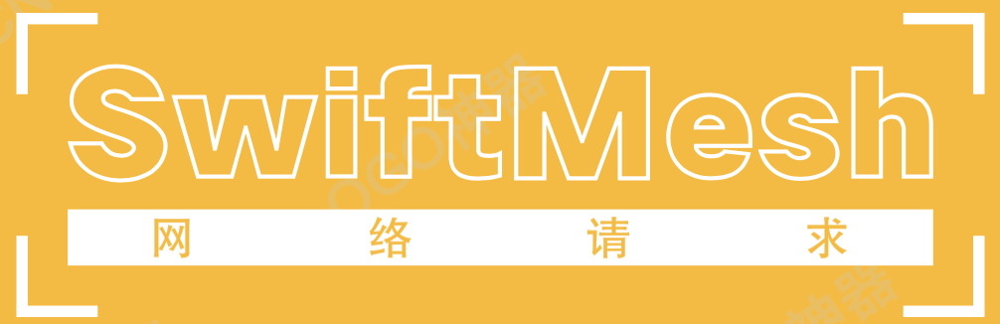

[](http://cocoapods.org/pods/SwiftMesh)
[](https://swift.org/package-manager/)


SwiftMesh是基于Alamofire和Codable的二次封装,使用Combine和Swift Concurrency,支持SwiftUI以及UIKit,去掉了闭包回调,更加简洁快速,使用更加方便。


涉及到的设计模式有：适配器，单例等等

## 用法

#### Swift+UIKit：

```swift
import UIKit
import Combine
import SwiftMesh
class ViewController: UIViewController {
    var request = RequestModel()
    private var cancellables: Set<AnyCancellable> = []
    
    override func viewDidLoad() {
        super.viewDidLoad()
 
        request.getAppliances()
        
        request.$cityResult
            .receive(on: RunLoop.main)
            .sink { (model) in
                print("请求数据Model \(String(describing: model))")
         }.store(in: &cancellables)
        
        request.$yesterday
            .receive(on: RunLoop.main)
            .sink { (model) in
                print("请求数据Model \(String(describing: model))")
         }.store(in: &cancellables)
    }
 
}


```

#### SwiftUI：

```swift
struct SwiftUIView: View {
    @StateObject var request = RequestModel()
    
    var body: some View {
        
        VStack{
            Text("Hello, World!")
            Text(request.cityResult?.message ?? "")
            Text(request.yesterday?.notice ?? "")
        }.onAppear{
            request.getAppliances()
        }
    }
    
}
```


## 介绍


### Mesh：单例

* 设置默认参数     —setDefaultParameters

  ```swift
      // MARK: 设置默认参数
      /// 设置默认参数
      /// - Parameter parameters: 默认参数
      public func setDefaultParameters(_ parameters: [String: Any]?) -> Self 
  ```

* 默认header     —setGlobalHeaders

  ```swift
      // MARK: 设置全局 headers
      /// 设置全局 headers
      /// - Parameter headers:全局 headers
      public func setGlobalHeaders(_ headers: HTTPHeaders?)  -> Self
  ```

网络请求的配置，用于设置请求超时时间、请求方式，参数，header，API地址，上传用的表单等等,使用链式语法配置。

```swift
    ///设置日志输出级别
    func logStatus(_ log: LogLevel) -> Self 
    /// 超时配置
    func timeout(_ timeout: TimeInterval) -> Self
    ///请求失败重试策略
    func interceptor(_ interceptor: RequestInterceptor?) -> Self
    /// 请求方式
    func requestMethod(_ requestMethod: HTTPMethod) -> Self 
    /// 添加请求头
    func addHeads(_ addHeads: HTTPHeaders?) -> Self 
    /// 请求编码
    func requestEncoding(_ requestEncoding: ParameterEncoding) -> Self 
    /// 请求地址
    func url(_ url: String?) -> Self
    ///参数  表单上传也用
    func parameters(_ parameters: [String: Any]?) -> Self 
    //下载类型
    func downloadType(_ downloadType: DownloadType) -> Self 
    //设置文件下载地址覆盖方式等等
    func destination(_ destination: @escaping DownloadRequest.Destination) -> Self
    ///已经下载的部分,下载续传用,从请求结果中获取
    func resumeData(_ resumeData: Data?) -> Self
    //上传类型
    func uploadType(_ uploadType: UploadType) -> Self 
    ///上传文件地址
    func fileURL(_ fileURL: URL?) -> Self
    ///上传文件地址
    func fileData(_ fileData: Data?) -> Self 
    ///上传文件InputStream
    func stream(_ stream: InputStream?) -> Self
    ///表单数据
    func uploadDatas(_ uploadDatas: [MultipleUpload]) -> Self 
    /// 表单数组快速添加表单
    /// - Parameters:
    ///   - name: 表单 name 必须
    ///   - fileName: 文件名
    ///   - fileData: 文件 Data
    ///   - fileURL:  文件地址
    ///   - mimeType: 数据类型
    func addformData(name: String,
                     fileName: String? = nil,
                     fileData: Data? = nil,
                     fileURL: URL? = nil,
                     mimeType: String? = nil)  -> Self
```

### Request：解析请求
请结合自己的使用情况自行创建。使用ObservableObject,方便SwiftUI和UIKit混合开发使用,结合Combine。用例参考Request类：
```swift
class RequestModel: ObservableObject {
    @MainActor @Published var yesterday: Forecast?

    @MainActor @Published var cityResult: CityResult?
    
    func getAppliances() {
        Task{
            do {
                //只解析需要的部分路径
                let data  =
            try await Mesh.shared
                .requestMethod(.get)
                .url("http://t.weather.itboy.net/api/weather/city/101030100")
                .request(of: Forecast.self, modelKeyPath: "data.yesterday")

                await MainActor.run {
                    self.yesterday = data
                }
                
            } catch let error {
                print(error.localizedDescription)
            }
        }
        
    }
}
```


## 安装

### Cocoapods

1.在 Podfile 中添加 `pod ‘SwiftMesh’`  

不需要Codable解析的可以直接`pod ‘SwiftMesh/Mesh’`

2.执行 `pod install 或 pod update`

3.导入 `import SwiftMesh`

### Swift Package Manager

从 Xcode 11 开始，集成了 Swift Package Manager，使用起来非常方便。SwiftMesh 也支持通过 Swift Package Manager 集成。

在 Xcode 的菜单栏中选择 `File > Swift Packages > Add Pacakage Dependency`，然后在搜索栏输入

`https://github.com/jackiehu/SwiftMesh`，即可完成集成，默认依赖Alamofire。

### 手动集成

SwiftMesh 也支持手动集成，只需把Sources文件夹中的SwiftMesh文件夹拖进需要集成的项目即可


## 更多砖块工具加速APP开发

[](https://github.com/jackiehu/SwiftBrick)

[](https://github.com/jackiehu/SwiftMediator)

[](https://github.com/jackiehu/SwiftShow)

[](https://github.com/jackiehu/SwiftLog)

[](https://github.com/jackiehu/SwiftyForm)

[](https://github.com/jackiehu/SwiftEmptyData)

[](https://github.com/jackiehu/SwiftPageView)

[](https://github.com/jackiehu/JHTabBarController)

[](https://github.com/jackiehu/SwiftNotification)

[](https://github.com/jackiehu/SwiftNetSwitch)

[](https://github.com/jackiehu/SwiftButton)

[](https://github.com/jackiehu/SwiftDatePicker)
