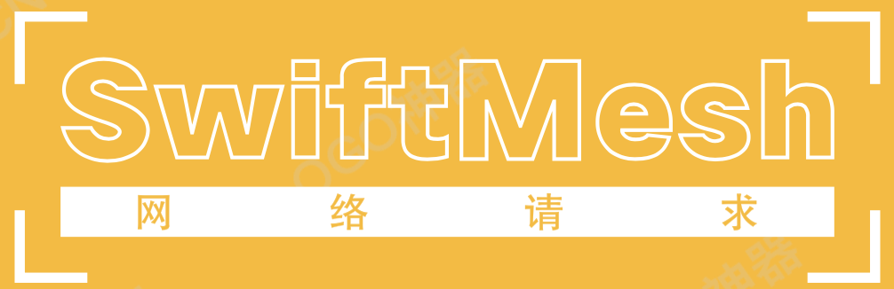

[](http://cocoapods.org/pods/SwiftMesh)
[](https://swift.org/package-manager/)


SwiftMesh是基于Alamofire和Codable的二次封装,使用Combine和Swift Concurrency,支持SwiftUI以及UIKit,去掉了闭包回调,更加简洁快速,使用更加方便。

涉及到的设计模式有：适配器、单例、构建器、属性包装器等。

## 特性

- **Async/Await API** — 所有请求方法均使用 `async throws`，消除回调地狱
- **链式配置** — 构建器模式，如 `.setRequestMethod(.get).setUrlHost("...")`
- **JSON 键路径解析** — 通过点分隔路径提取嵌套 JSON（如 `"data.yesterday"`）
- **文件上传** — 支持文件 URL、Data、InputStream 和多部分表单上传
- **文件下载** — 支持普通下载和断点续传
- **全局默认值** — 一次设置默认请求头、参数和 URL host，自动与单次请求合并
- **弹性 Codable** — 属性包装器（`@Default`、`@IgnoreError`、`@ConvertToString` 等）优雅处理不一致的 API 响应
- **内置重试策略** — 可配置的线性退避重试
- **网络日志** — 内置日志输出 cURL 命令、状态码、耗时和格式化 JSON
- **Combine 集成** — 与 `ObservableObject` 和 `@Published` 天然配合
- **SwiftUI + UIKit 支持** — 为混合开发环境设计

## 快速开始

### 1. 基础 GET 请求

```swift
let result = try await Mesh()
    .setRequestMethod(.get)
    .setUrlHost("https://api.example.com")
    .setUrlPath("/weather/city/101030100")
    .request(of: Weather.self)
```

### 2. GET 带 JSON 键路径

仅提取 JSON 的嵌套部分：

```swift
// JSON: { "code": 200, "data": { "yesterday": { "temp": 25 } } }
let yesterday = try await Mesh()
    .setRequestMethod(.get)
    .setUrlHost("https://api.example.com")
    .setUrlPath("/weather")
    .request(of: Forecast.self, modelKeyPath: "data.yesterday")
```

### 3. POST 带参数

```swift
let result = try await Mesh()
    .setRequestMethod(.post)
    .setUrlHost("https://api.example.com")
    .setUrlPath("/login")
    .setParameters(["username": "admin", "password": "123456"])
    .request(of: LoginResult.self)
```

### 4. 文件下载

```swift
let fileURL = try await Mesh()
    .setRequestMethod(.get)
    .setUrlHost("https://example.com")
    .setUrlPath("/files/document.pdf")
    .setDestination { _, _ in
        let dest = FileManager.default.urls(for: .documentDirectory, in: .userDomainMask)[0]
            .appendingPathComponent("document.pdf")
        return (dest, [.removePreviousFile, .createIntermediateDirectories])
    }
    .download()
```

### 5. 文件上传（多部分表单）

```swift
let result = try await Mesh()
    .setRequestMethod(.post)
    .setUrlHost("https://api.example.com")
    .setUrlPath("/upload/image")
    .setUploadType(.multipart)
    .setAddformData(name: "file",
                    fileName: "photo.jpg",
                    fileData: imageData,
                    mimeType: "image/jpeg")
    .upload(of: UploadResult.self)
```

---

## 用法

#### Swift+UIKit：

```swift
import UIKit
import Combine
import SwiftMesh

class ViewController: UIViewController {
    var request = RequestModel()
    private var cancellables: Set<AnyCancellable> = []
    
    override func viewDidLoad() {
        super.viewDidLoad()
 
        request.getAppliances()
        
        request.$cityResult
            .receive(on: RunLoop.main)
            .sink { (model) in
                print("请求数据Model \(String(describing: model))")
         }.store(in: &cancellables)
        
        request.$yesterday
            .receive(on: RunLoop.main)
            .sink { (model) in
                print("请求数据Model \(String(describing: model))")
         }.store(in: &cancellables)
    }
 
}
```

#### SwiftUI：

```swift
struct SwiftUIView: View {
    @StateObject var request = RequestModel()
    
    var body: some View {
        
        VStack{
            Text("Hello, World!")
            Text(request.cityResult?.message ?? "")
            Text(request.yesterday?.notice ?? "")
        }.onAppear{
            request.getAppliances()
        }
    }
    
}
```

---

## API 参考

### Mesh：核心构建类

所有网络请求的核心配置持有者，支持链式调用。

#### 全局静态方法

| 方法 | 说明 |
|------|------|
| `Mesh.enableLog(_:)` | 启用网络日志（`.print` 或 `.log`） |
| `Mesh.setHeaders(_:)` | 设置全局默认请求头 |
| `Mesh.setParameters(_:)` | 设置全局默认参数 |
| `Mesh.setUrlHost(_:)` | 设置全局默认 URL 主机地址 |

#### 实例配置（链式调用）

| 方法 | 说明 |
|------|------|
| `.setTimeout(_:)` | 请求超时时间（秒，默认 15） |
| `.setInterceptor(_:)` | 请求拦截器（如 RetryPolicy） |
| `.setRequestMethod(_:)` | HTTP 方法（GET、POST、PUT、DELETE 等） |
| `.setHeads(_:)` | 单次请求头 |
| `.setRequestEncoding(_:)` | 参数编码（URLEncoding、JSONEncoding） |
| `.setUrlHost(_:)` | 单次请求 URL 主机地址 |
| `.setUrlPath(_:)` | URL 路径 |
| `.setParameters(_:)` | 请求参数 |

#### 下载配置

| 方法 | 说明 |
|------|------|
| `.setDownloadType(_:)` | `.download` 或 `.resume` |
| `.setDestination(_:)` | 文件保存位置和行为 |
| `.setResumeData(_:)` | 中断下载的续传数据 |

#### 上传配置

| 方法 | 说明 |
|------|------|
| `.setUploadType(_:)` | `.file`、`.data`、`.stream` 或 `.multipart` |
| `.setFileURL(_:)` | 上传文件 URL |
| `.setFileData(_:)` | 上传文件 Data |
| `.setStream(_:)` | 上传用输入流 |
| `.setUploadDatas(_:)` | 多部分表单条目数组 |
| `.setAddformData(...)` | 快速添加单个表单字段 |

### Request：执行请求

| 方法 | 说明 |
|------|------|
| `.request(of:modelKeyPath:)` | 发送请求并解码为 Codable 模型 |
| `.urlRequest(_:type:modelKeyPath:)` | 发送 URLRequest 并解码为 Codable 模型 |
| `.requestData()` | 返回原始响应 Data |
| `.requestString()` | 返回响应字符串 |
| `.upload(of:modelKeyPath:)` | 上传文件并解码响应 |
| `.download()` | 下载文件并返回本地 URL |

### 弹性 Codable 包装器

| 包装器 | 默认行为 |
|--------|---------|
| `@Default.True` | 缺失 → `true` |
| `@Default.False` | 缺失 → `false` |
| `@Default.EmptyString` | 缺失 → `""` |
| `@Default.EmptyInt` | 缺失 → `0` |
| `@Default.EmptyArray` | 缺失 → `[]` |
| `@Default.EmptyDictionary` | 缺失 → `[:]` |
| `@Default.Now` | 缺失 → `Date()` |
| `@IgnoreError` | 无效 → `nil`（不崩溃） |
| `@ConvertToString` | String/Int/Double → `String?` |
| `@ConvertToInt` | Int/String/Double → `Int?` |
| `@ConvertToDouble` | Double/Int/Float/String → `Double?` |
| `@ConvertToFloat` | Float/Int/Double/String → `Float?` |

### RetryPolicy 重试策略

内置线性退避重试（1秒、2秒、3秒...）：

```swift
let policy = RetryPolicy(maxRetryCount: 3)  // 默认重试 3 次
```

---

## AI Skills 使用教程

SwiftMesh 包含了一个专为 AI 编程助手设计的 **SKILL.md** 文件。该文件是一份完整的参考文档，AI 工具可以借助它生成正确的 SwiftMesh 代码。

### 什么是 SKILL.md？

`SKILL.md` 是一份结构化文档，包含：
- 完整的 API 参考（所有方法和参数）
- 16+ 个即用型代码示例，覆盖所有场景
- 属性包装器使用模式
- AI 提示词模板，用于常见任务
- 错误处理和配置指南

### AI 如何使用 SKILL.md？

当使用 AI 编程助手（如 Cursor、GitHub Copilot、Claude 或 ChatGPT）时，AI 可以引用 `SKILL.md` 来：

1. **理解 API** — 所有方法、参数和返回类型都有文档说明
2. **生成正确代码** — 示例展示了准确的语法和链式调用模式
3. **处理边界情况** — 弹性 Codable 包装器应对不一致的 API
4. **遵循最佳实践** — 正确的 Combine 集成、错误处理等

### 在 AI 助手中使用 SKILL.md

#### 方法一：直接引用文件

告诉你的 AI 助手读取 SKILL.md 文件：

```
读取本项目中的 SKILL.md 文件，并根据它生成 SwiftMesh 代码。
```

#### 方法二：使用 AI 提示词模板

SKILL.md 中内置了提示词模板，复制并填写即可：

**发起 GET 请求：**
```
使用 SwiftMesh 向 https://api.example.com/weather 发起 GET 请求，将响应解码为 Weather 结构体。使用键路径 "data.current" 提取嵌套数据。
```

**上传文件：**
```
使用 SwiftMesh 将图片 Data 上传到 https://api.example.com/upload，多部分表单字段名为 "photo"，MIME 类型为 "image/jpeg"。将响应解码为 UploadResult。
```

**处理类型不确定的 API：**
```
为以下 JSON 创建一个 Codable 结构体：{"code": 200, "data": {"name": "test", "count": "42"}}。使用 @Default、@IgnoreError 和 @ConvertTo* 包装器处理缺失或类型不一致的字段。
```

#### 方法三：快速参考卡

SKILL.md 开头提供了快速参考卡，AI 可用于快速查找：

| 需求 | 使用 |
|------|------|
| GET 请求 | `.request(of: Model.self)` |
| 嵌套 JSON | `.request(of: Model.self, modelKeyPath: "data.user")` |
| 上传文件 | `.upload(of: Result.self)` |
| 下载文件 | `.download()` |
| 自动重试 | `.setInterceptor(RetryPolicy())` |
| 启用日志 | `Mesh.enableLog()` |

### SKILL.md 内容概览

| 章节 | 内容 |
|------|------|
| 快速参考卡 | 常见任务的一行速查 |
| 核心架构 | 文件结构和设计模式 |
| 使用模式 | 16 个完整代码示例 |
| 全局配置 | 应用级设置 |
| 弹性 Codable | 所有属性包装器及示例 |
| JSON 键路径 | 嵌套提取用法 |
| Combine + SwiftUI | ObservableObject 模式 |
| 错误处理 | 错误类型和捕获 |
| 重试策略 | 重试配置 |
| 日志 | 日志器设置和输出 |
| 方法参考 | 完整 API 表格 |
| AI 提示词模板 | 填空式提示词 |

---

## 安装

### Cocoapods

1. 在 Podfile 中添加 `pod 'SwiftMesh'`
2. 执行 `pod install` 或 `pod update`
3. 导入 `import SwiftMesh`

### Swift Package Manager

从 Xcode 11 开始，集成了 Swift Package Manager，使用起来非常方便。SwiftMesh 也支持通过 Swift Package Manager 集成。

在 Xcode 的菜单栏中选择 `File > Swift Packages > Add Package Dependency`，然后在搜索栏输入：

`https://github.com/zjinhu/SwiftMesh`，即可完成集成，默认依赖 Alamofire。

### 手动集成

SwiftMesh 也支持手动集成，只需把 Sources 文件夹中的 SwiftMesh 文件夹拖进需要集成的项目即可。

---

## 更多砖块工具加速 APP 开发

[](https://github.com/zjinhu/SwiftBrick)

[](https://github.com/zjinhu/SwiftMediator)

[](https://github.com/zjinhu/SwiftShow)

[](https://github.com/zjinhu/SwiftLog)

[](https://github.com/zjinhu/SwiftyForm)

[](https://github.com/zjinhu/SwiftEmptyData)

[](https://github.com/zjinhu/SwiftPageView)

[](https://github.com/zjinhu/JHTabBarController)

[](https://github.com/zjinhu/SwiftNotification)

[](https://github.com/zjinhu/SwiftNetSwitch)

[](https://github.com/zjinhu/SwiftButton)

[](https://github.com/zjinhu/SwiftDatePicker)
